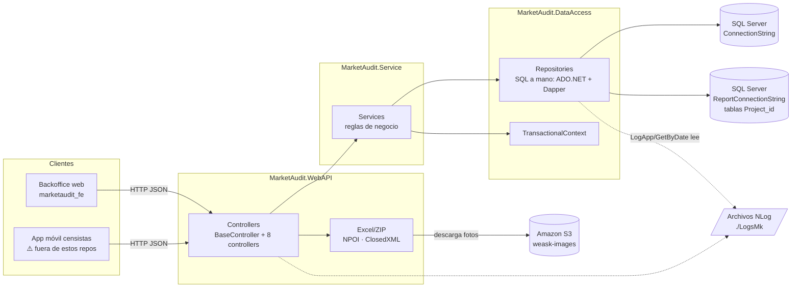
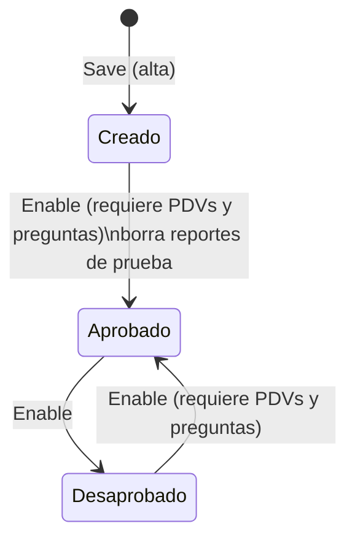
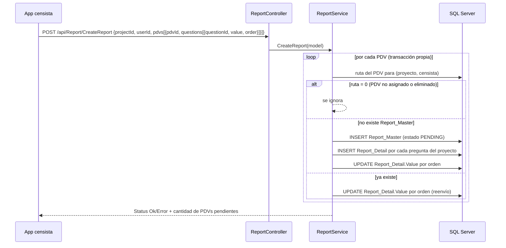
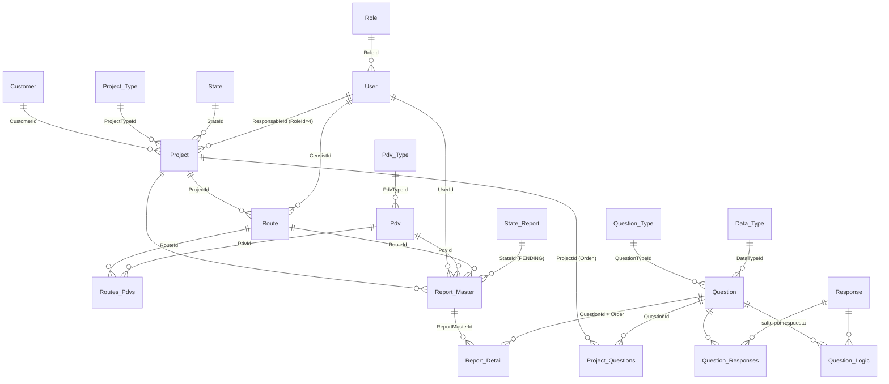

# MarketAudit Backend

API REST de **MarketAudit**, una plataforma de auditoría de puntos de venta (PDV) basada en relevamientos de campo: se crean *proyectos* de auditoría para *clientes*, se les carga un cuestionario y un listado de PDVs agrupados en *rutas* asignadas a *censistas*, los censistas envían las respuestas (incluyendo fotos) y el backoffice consulta informes y descarga fotos.

> Este documento se generó a partir del análisis del código del repositorio. Cuando algo no puede determinarse desde el código se indica con ⚠️.

---

## Índice

1. [Descripción](#1-descripción)
2. [Stack tecnológico](#2-stack-tecnológico)
3. [Arquitectura](#3-arquitectura)
4. [Estructura del proyecto](#4-estructura-del-proyecto)
5. [Módulos funcionales](#5-módulos-funcionales)
6. [Modelo de dominio](#6-modelo-de-dominio)
7. [API](#7-api)
8. [Autenticación y autorización](#8-autenticación-y-autorización)
9. [Persistencia](#9-persistencia)
10. [Configuración](#10-configuración)
11. [Cómo ejecutar el Backend](#11-cómo-ejecutar-el-backend)
12. [Testing](#12-testing)
13. [Logging y manejo de errores](#13-logging-y-manejo-de-errores)
14. [Integraciones externas](#14-integraciones-externas)
15. [Troubleshooting](#15-troubleshooting)
16. [Guía rápida para desarrolladores](#guía-rápida-para-desarrolladores)
17. [Getting Started del ecosistema completo](#getting-started-del-ecosistema-completo)
18. [Deuda técnica y riesgos conocidos](#deuda-técnica-y-riesgos-conocidos)

---

## 1. Descripción

### Qué es MarketAudit

Del código se desprende el siguiente dominio de negocio:

| Concepto | Significado |
|---|---|
| **Cliente** (`Customer`) | Empresa para la cual se realiza la auditoría. |
| **Proyecto** (`Project`) | Una campaña de auditoría para un cliente, con tipo, responsable, fechas y estado. |
| **Pregunta** (`Question`) | Ítem del cuestionario del proyecto (tipo de pregunta, tipo de dato, respuestas posibles, lógica de salto). |
| **PDV** (`Pdv`) | Punto de venta a relevar (número, nombre, CUIT, dirección, tipo). |
| **Ruta** (`Route`) | Agrupación de PDVs de un proyecto asignada a **un** censista. |
| **Censista** | Usuario que realiza el relevamiento en campo. |
| **Reporte** (`Report_Master` / `Report_Detail`) | Respuestas de un censista para un PDV de una ruta de un proyecto. |

### Consumidores de la API

La API atiende a dos tipos de clientes:

1. **Backoffice web** (repositorio `marketaudit_fe`, React): administración de clientes, usuarios y proyectos, carga masiva por Excel, informe de auditoría, portal de fotos y visor de logs.
2. **Aplicación de censistas (móvil)**: *no está en estos repositorios*, pero su existencia se infiere del código:
   - `POST /api/Auth/Login` devuelve el árbol completo de proyectos → rutas → PDVs → preguntas → respuestas del censista (el backoffice web solo usa `userId`/`userName`).
   - `POST /api/Report/CreateReport` recibe las respuestas de las encuestas ("Servicio para enviar los datos de las encuestas").
   - `GET /api/Report/GetReportPdv` devuelve indicadores de avance por censista.
   - `GET /api/Configuration/GetConfigurationXML` devuelve textos en formato `<resources><string name="...">` (formato de recursos Android).
   - `POST /api/LogApp/SetLogApp` registra logs enviados por la app.

   > ⚠️ No determinado a partir del código disponible: repositorio, tecnología y versión de la aplicación móvil.

### Responsabilidad del Backend

- Exponer la API REST para backoffice y app móvil.
- Aplicar reglas de negocio (estados de proyecto, validaciones, importación de Excel).
- Persistir en SQL Server (base principal) y generar tablas de informe por proyecto en una segunda base (base de reportes).
- Generar exportaciones Excel (`.xlsx`) y ZIP de fotos.
- Registrar logs en archivo (NLog) y exponerlos al backoffice.

---

## 2. Stack tecnológico

Versiones tomadas de los `.csproj` y archivos de configuración.

| Tecnología | Versión | Dónde |
|---|---|---|
| .NET Core / ASP.NET Core | `netcoreapp3.1` (todos los proyectos) | `*/*.csproj` |
| Hosting | Kestrel / IIS In-Process (`AspNetCoreHostingModel=InProcess`) | `MarketAudit.WebAPI.csproj` |
| Base de datos | Microsoft SQL Server (usa `STRING_AGG`, `scope_identity()`, `INFORMATION_SCHEMA`) | `MarketAudit.DataAccess` |
| Acceso a datos | ADO.NET `System.Data.SqlClient` 4.8.1 + **Dapper** 2.0.123 (SQL escrito a mano, sin ORM) | `MarketAudit.DataAccess.csproj` |
| Swagger | Swashbuckle.AspNetCore 5.0.0 | `MarketAudit.WebAPI.csproj` |
| Excel (lectura de importaciones) | DotNetCore.NPOI 1.2.2 | `ProjectController` |
| Excel (generación de exportaciones) | ClosedXML 0.95.3 | `ExportController` |
| Logging | NLog 4.7.0 | `MarketAudit.Common`, `nlog.config` |
| Serialización | System.Text.Json (6.0.2 en `MarketAudit.Service`) | |
| Herramienta local | `dotnet-ef` 3.1.4 declarada en `.config/dotnet-tools.json` (**no se usa**: no hay EF Core ni migraciones) | |

---

## 3. Arquitectura

Arquitectura en **capas** con una solución de 5 proyectos (`MarketAudit.sln`). Las dependencias van en una sola dirección:



Proyectos y referencias:

```text
MarketAudit.WebAPI ──► MarketAudit.Service ──► MarketAudit.DataAccess ──► MarketAudit.Entities
        │                                              │
        └──────────────► MarketAudit.Common ◄──────────┘
        └──────────────► MarketAudit.Entities
```

Particularidades importantes (verificadas en el código):

- **Inyección de dependencias parcial.** `Startup.CargarSingletones` registra por reflexión, como *singletons*, cada método estático de `MarketAudit.Service/ServiceFactory.cs`. Los servicios, a su vez, **instancian los repositorios con `new`** en sus constructores (no hay DI entre Service y DataAccess). Para agregar un servicio nuevo hay que agregar un método en `ServiceFactory`.
- **Configuración global estática.** Al iniciar, `Startup` lee `App.json` y guarda las cadenas de conexión en `MarketAudit.Common/GlobalVariables/GlobalVariables.cs`; repositorios y `TransactionalContext` las toman de ahí.
- **Transacciones manuales.** `TransactionalContext` abre una conexión y una transacción `ReadCommitted` al construirse; los servicios hacen `Commit()`/`Rollback()` explícitos.
- **Sin middlewares propios.** El pipeline es: CORS (cualquier origen) → Routing → DeveloperExceptionPage/HSTS → HTTPS redirection → Controllers → Swagger. No hay autenticación ni autorización en el pipeline.
- **Sin procesos en background.** No hay hosted services, jobs ni schedulers. Los procesos "batch" (generación de tablas de reporte) se disparan llamando endpoints (ver [Informes](#54-informes-de-auditoría)).

---

## 4. Estructura del proyecto

```text
marketaudit/
├── MarketAudit.sln
├── MarketAudit.WebAPI/           # Host ASP.NET Core (punto de entrada)
│   ├── Program.cs                # WebHost, Kestrel KeepAlive 15 min
│   ├── Startup.cs                # CORS, MVC, Swagger, NLog, carga de App.json, registro de servicios
│   ├── Controllers/              # Endpoints REST (api/{controller}/{action})
│   ├── Helpers/                  # Lectura de App.json (AppConfiguration, ConfigurationHelper)
│   ├── Options/                  # SwaggerOptions (no se usa en Startup)
│   ├── App.json                  # Configuración real de la app (cadenas de conexión, ruta de logs)
│   ├── appsettings*.json         # Logging de ASP.NET (sus claves ConnectionString/PathLogs no se leen)
│   ├── nlog.config               # Destino y formato de logs
│   ├── MarketAudit.WebAPI.xml    # Comentarios XML para Swagger
│   └── Properties/launchSettings.json
├── MarketAudit.Service/          # Lógica de negocio
│   ├── ServiceFactory.cs         # Fábrica registrada en el contenedor de DI
│   ├── Interfaces/               # I*Service
│   └── Services/                 # Implementaciones
├── MarketAudit.DataAccess/       # Acceso a datos (SQL Server)
│   ├── Interfaces/               # I*Repository, ITransactionalContext
│   └── Repositories/             # SQL por entidad + DataBaseRepository/BaseRepository/TransactionalContext
├── MarketAudit.Entities/         # Modelos, DTOs de request/response, enum de estados
│   ├── Models/                   # Entidades de dominio y modelos de lectura
│   ├── Models/Request/           # Payloads de entrada (login, reportes, importaciones)
│   ├── Models/Response/          # Payloads de salida (login, filtros, fotos, recursos XML)
│   ├── Models/Generic/           # ResponseData, DataTableModel, KeyValueDto
│   └── Enum/States.cs            # Estados de proyecto
└── MarketAudit.Common/           # Transversal
    ├── GlobalVariables/          # Cadenas de conexión globales + constantes de columnas Excel
    ├── Log/                      # ILoggerManager / LoggerManager (NLog)
    └── Exceptions/               # DatabaseConnectionException, DatabaseQueryExecutionException
```

| Carpeta | Responsabilidad | Modificar cuando… |
|---|---|---|
| `WebAPI/Controllers` | Recibir HTTP, validar `ModelState`, parsear Excel, armar la respuesta (`MakeOkResponse`, `InternalServerError`). | Se agrega/cambia un endpoint, un formato de importación Excel o una exportación. |
| `WebAPI/Startup.cs` | Pipeline HTTP, CORS, Swagger, carga de configuración. | Se cambia CORS, se agrega autenticación, middlewares o configuración. |
| `Service/Services` | Reglas de negocio y orquestación de repositorios/transacciones. | Cambia una regla de negocio o un flujo. |
| `Service/ServiceFactory.cs` | Registro de servicios en DI. | Se crea un servicio nuevo. |
| `DataAccess/Repositories` | Todas las consultas SQL (strings), llamadas a stored procedures y a la base de reportes. | Cambia el esquema, una consulta o se necesita un dato nuevo. |
| `Entities/Models` | Contratos de datos (entrada/salida y filas de BD). | Cambia un contrato con el Frontend/app o una tabla. |
| `Common` | Logging, constantes (columnas de Excel), configuración global. | Cambia el logging o las columnas esperadas de los Excel. |

---

## 5. Módulos funcionales

### 5.1 Autenticación

- **Objetivo:** validar usuario/contraseña y devolver los datos que necesita el cliente.
- **Componentes:** `AuthController` → `AuthService` → `AuthRepository` (+ `ProjectService.GetProjectsByUserId`).
- **Lógica:** ver [sección 8](#8-autenticación-y-autorización).

### 5.2 Clientes

- **Objetivo:** ABM de clientes (nombre, descripción, logo como URL/texto) con habilitación/deshabilitación.
- **Componentes:** `CustomerController` → `CustomerService` → `CustomerRepository` (tabla `Customer`).
- **Reglas:** alta con `Enable = true`; `Enable` alterna el estado de cada id recibido; `Delete` es borrado físico; validaciones por DataAnnotations (`Name` ≤ 50, `Description` ≤ 255, ambos requeridos).
- Solo los clientes habilitados aparecen en el combo de proyectos (`GetCustomers(bool enable = true)`).

### 5.3 Usuarios

- **Objetivo:** ABM de usuarios (backoffice, censistas, responsables).
- **Componentes:** `UserController` → `UserService` → `UserRepository`, `RolRepository` (tablas `User`, `Role`).
- **Reglas:**
  - La contraseña se guarda como **hash SHA-256 en hexadecimal mayúscula** (sin salt). En edición, si la contraseña viene vacía no se modifica.
  - `Enable` alterna `Enabled` y registra `EndDate` (fecha de baja) al deshabilitar.
  - `Delete` es borrado físico.
  - **Responsables de proyecto** = usuarios con `RoleId = 4` y habilitados (valor fijo en `UserRepository.GetResponsables`).
  - `UserTest` (`IsUserTest` en BD) marca un **usuario de prueba**: ve proyectos en estado *Creado* desde la app (ver 5.4).
  - Validaciones DataAnnotations en `Entities/Models/User.cs`.
  - ⚠️ Los códigos/descripciones de los roles viven en la tabla `Role`; salvo el id 4 no se pueden determinar desde el código.

### 5.4 Proyectos (módulo central)

**Componentes:** `ProjectController` → `ProjectService` → `ProjectRepository`, `QuestionRepository`, `ResponseRepository`, `PdvRepository`, `RouteRepository`, `ReportDetailRepository`, `ProjectQuestionRepository`, catálogos (`ProjectType`, `State`, `QuestionType`, `DataType`, `PdvType`).

#### Estados del proyecto

Definidos en `Entities/Enum/States.cs` y tabla `State` (columna `Code`):



| Id | Enum | `State.Code` usado en SQL | Visible en la app para |
|---|---|---|---|
| 1 | `Create` | `CREATE` | Solo usuarios de prueba (`IsUserTest = 1`) |
| 2 | `Aprobado` | `APP` | Usuarios normales (`IsUserTest = 0`) |
| 3 | `Desaporbado` | ⚠️ no referenciado | Nadie |

Reglas de `ProjectService.Enable(id)`:
- Si el proyecto está en *Creado* o *Desaprobado* y **no tiene PDVs en rutas o no tiene preguntas**, devuelve `Status = "Validation"` con el mensaje "Para habilitar el proyecto … debe cargar PDV's y Preguntas".
- Al pasar de *Creado* a *Aprobado* ejecuta `dbo.DeleteReport` (borra respuestas cargadas durante las pruebas).
- Desde *Aprobado* pasa a *Desaprobado*.
- El endpoint recibe un array de ids pero **solo procesa el primero**.

#### Alta/edición (`Save`)

Valida tipo de proyecto, cliente y responsable seleccionados, y `StartDate <= FinishDate`. El alta crea el proyecto en estado *Creado* con `SAS = false`. `GetNewProject`/`GetProject` devuelven el modelo con los combos (`ProjectTypeList`, `CustomerList`, `ResponsableList`).

#### Importación de preguntas (Excel) — `POST /api/Project/ImportQuestions`

`multipart/form-data` con campo `id` (proyecto) y un archivo. Se lee la **primera hoja** con NPOI desde la fila 2 (la fila 1 es encabezado). Una fila se procesa si la columna B tiene texto; **el orden de la pregunta es el número de fila**.

| Col | Campo (`Constantes.QuestionExcelFields`) | Formato |
|---|---|---|
| A | (ignorada) | |
| B | `Pregunta` | texto |
| C | `Descripcion` | texto (es el encabezado de columna en el informe) |
| D | `Miniatura` | texto (URL de imagen) |
| E | `Requerida` | `"Si"` = requerida |
| F | `Disparadora` | lógica de salto: `respuesta;saltos` separados por `\|` (ej. `No;3\|N/A;5`) |
| G | `TipoPregunta` | `Code` existente en `Question_Type` |
| H | `TipoDato` | `Code` existente en `Data_Type` |
| I | `Respuestas` | opciones separadas por `;` |

`ProjectService.SaveQuestions` (todo en una transacción):
1. `dbo.DeleteReport` y `dbo.DeleteQuestion` del proyecto → **reemplaza** el cuestionario completo y borra respuestas existentes.
2. Inserta cada `Question`; reutiliza `Response` existentes por texto o las crea; vincula en `Question_Responses`.
3. Crea `Question_Logic` (respuesta → cantidad de preguntas a saltar).
4. Vincula en `Project_Questions` con el orden.

El Frontend solo habilita esta carga cuando el proyecto está en estado *Creado*.

#### Importación de PDVs (Excel) — `POST /api/Project/ImportPDV`

Mismo mecanismo. Una fila se procesa si la columna C tiene valor y el censista no está vacío.

| Col | Campo (`Constantes.PdvExcelFields`) | Formato |
|---|---|---|
| A | `Censist` | `UserName` de un usuario existente (si no existe, falla toda la importación) |
| B | `Number` | numérico |
| C | `Name` | texto |
| D | `Cuit` | texto |
| E | `Address` | texto |
| F | `PdvType` | `Description` existente en `Pdv_Type` (si no existe, falla) |
| G | `Route` | identificador de ruta (se nombra "Ruta {n}") |
| H | `Notes` | texto |
| I | `Language` | `es` / `en` / `pt` (por defecto `es`) — idioma del nombre/descr. de la ruta |

`ProjectService.SavePdvs`: por fila busca el censista, crea o reutiliza la ruta `(proyecto, censista, nombre)`, inserta el `Pdv` y lo vincula en `Routes_Pdvs`. Al final ejecuta `FixDuplicateRoutes`. **No borra** PDVs previos: la importación es acumulativa (existe `DeleteDuplicatePdvs` para limpiar duplicados).

#### Alta individual

- `POST /api/Project/SaveQuestion` (`QuestionModelRequest`): agrega una pregunta sin borrar las existentes (sí ejecuta `DeleteReport`).
- `POST /api/Project/SavePdv` (`PdvModelRequest`): agrega un PDV a la ruta indicada.
- `PUT /api/Project/UpdateQuestion` y `PUT /api/Project/UpdatePdv` **no tienen implementación** (devuelven OK sin hacer nada).
- `GET GetQuestionTemplateByProjectId` / `GetPdvTemplateByProjectId` devuelven el cuestionario/PDVs en el mismo formato de las columnas de importación.

⚠️ Ninguno de estos cinco endpoints es consumido por el Frontend web; no se pudo determinar quién los usa.

### 5.5 Relevamiento (envío de respuestas desde la app)



- Cada PDV se procesa en su propia transacción: si uno falla se cuenta como pendiente y los demás se guardan.
- El valor de una pregunta de tipo foto es una o varias URLs de S3 separadas por `|`.
- `GET /api/Report/GetReportPdv?userId=` ejecuta el SP `ReportResumenPdvByUser` por proyecto y calcula: PDVs pendientes, % de avance, promedio diario, tiempo consumido y mensaje de último envío (`Tendencia` está fijo en 5).

### 5.6 Informes de auditoría

- `GET /api/Project/GetProjectReports`: lista de proyectos (id, nombre) para el selector.
- `GET /api/Project/GetReportByProjectId?id=`: tabla dinámica (una fila por PDV relevado; columnas fijas `Usuario, Codigo PDV, PDV, Ruta, Fecha, Hora` + una columna por pregunta, con el texto de `Question.Description`).
  - Si existe la tabla `Project_{id}` en la **base de reportes**, lee de ahí (`GetReport`).
  - Si no, arma la tabla en memoria desde `Report_Master`/`Report_Detail` (`GetReportByProjectId`).
- Endpoints de mantenimiento de la base de reportes (no consumidos por el Frontend; ⚠️ no se pudo determinar si se invocan manualmente o por un proceso externo):
  - `POST CreateTableReportProcess`: recrea `Project_{id}` para proyectos en estado 1 y 2.
  - `POST CreateTableReportProcessById?id=`: recrea la tabla de un proyecto.
  - `POST ProcessReportTable?projectId=`: vuelca las respuestas en `Project_{id}`.
  - `GET ExistsTableReport?projectId=`, `POST GetReport?projectId=`.
- Regla fija en código: para el proyecto **52416** el informe desde `Report_Master` se limita a los últimos 7 días (`ReportDetailRepository.GetReportDetailsByProjectId`).

### 5.7 Portal de fotos

- `GET /api/Project/GetDataFilterPhoto?id=` → filtros disponibles (censistas, PDVs, rutas y preguntas con `QuestionTypeId = 3`).
- `GET /api/Project/GetPhotoByProjectId?id=&users=&pdvs=&routes=&questions=` → lista de fotos (`PhotosReport`). Los filtros son listas separadas por coma (PDVs por **número**). Solo toma valores que empiezan con `https://weask-images.s3.amazonaws.com`, descarta los que contienen `Fstorage` y separa múltiples URLs por `|`.
- `GET /api/Export/GetPhotos?...` → mismos filtros, descarga cada imagen desde S3 y devuelve un **ZIP** (`application/zip`).

### 5.8 Exportaciones Excel

`GET /api/Export/GetReport?report={tipo}&id={id}` devuelve un `.xlsx` (hoja "Datos") generado con ClosedXML.

| `report` | Contenido |
|---|---|
| `customer` | Clientes |
| `user` | Usuarios |
| `project` | Proyectos |
| `questionProject` | Preguntas del proyecto `id` |
| `pdvProject` | PDVs del proyecto `id` |
| `informe-auditoria` | Informe de auditoría del proyecto `id` (siempre desde `Report_Master`/`Report_Detail`) |

Cualquier otro valor produce error 500.

### 5.9 Logs

- `GET /api/LogApp/GetByDate?date=yyyy-M-d` → lee el archivo NLog del día (`./LogsMk/{yyyy-MM-dd}_logfile.log`) y lo devuelve como tabla (`Hora`, `Tipo`, `Descripcion`). Son los **logs de la propia API**.
- `POST /api/LogApp/SetLogApp` (`LogAppMk`) → inserta en la tabla `Log_App` (logs enviados por la app móvil).

### 5.10 Configuración / textos multilenguaje

- `GET /api/Configuration/GetConfiguration?language=` → pares clave/valor de la tabla `Recursos` (`Clave`, `Valor`, `Idioma`).
- `GET /api/Configuration/GetConfigurationXML?language=` → lo mismo en XML `<resources><string name="…">…</string></resources>`.

---

## 6. Modelo de dominio

Reconstruido a partir de las consultas SQL (no hay scripts de esquema en el repositorio).



Tablas principales (base `ConnectionString`):

| Tabla | Columnas relevantes usadas en el código |
|---|---|
| `User` | `Id, UserName, Password (SHA-256), Name, LastName, Email, RoleId, Enabled, Image, Creation, IsUserTest, EndDate` |
| `Role` | `Id, Code, Description` |
| `Customer` | `Id, Name, Description, Image, Enable` |
| `Project` | `Id, Name, Description, ProjectTypeId, CustomerId, ResponsableId, SAS, StateId, Creation, StartDate, FinishDate` |
| `Project_Type`, `Project_Size`, `State`, `Pdv_Type`, `Question_Type`, `Data_Type` | Catálogos `Id, Code, Description` |
| `Route` | `Id, Name, Description, ProjectId, CensistId, Image` |
| `Pdv` | `Id, Name, Description, Number, Notes, Cuit, Address, PdvTypeId, Visible, IsDeleted` |
| `Routes_Pdvs` | `Id, RouteId, PdvId, IsDeleted` |
| `Question` | `Id, Question, Description, QuestionTypeId, DataTypeId, Required, Image` |
| `Response` | `Id, Response, Icon` |
| `Question_Responses`, `Question_Logic` | Relaciones pregunta-respuesta y lógica de salto (`Value`) |
| `Project_Questions` | `Id, ProjectId, QuestionId, Orden` |
| `Report_Master` | `Id, ProjectId, UserId, PdvId, RouteId, Creation, StateId` y además `UserName, PdvNumber, Pdv, Route` (leídas en el informe) |
| `Report_Detail` | `Id, ReportMasterId, QuestionId, Value, Order, StateId` |
| `State_Report` | Estados de reporte (`CODE = 'PENDING'`) |
| `Log_App` | `UserId, ProjectId, PdvId, Message, Creation` |
| `Recursos` | `Clave, Valor, Idioma` |

Notas:
- **Soft delete de PDVs:** las consultas filtran `Pdv.IsDeleted = 0` y `Routes_Pdvs.IsDeleted = 0`. Ningún código C# asigna `IsDeleted`; ⚠️ se presume que lo hacen stored procedures o procesos externos.
- ⚠️ `Report_Master.UserName/PdvNumber/Pdv/Route` no se insertan desde el código: se leen en el informe, por lo que deben poblarse en la base (trigger, columna calculada o proceso externo). No determinado.
- **Base de reportes (`ReportConnectionString`):** tablas dinámicas `Project_{projectId}` con columnas `Usuario, Codigo_PDV, PDV, Ruta, Fecha, Hora, F_{orden}...`.

Stored procedures invocados (deben existir en la base principal):

| SP | Uso |
|---|---|
| `dbo.DeleteProject @ProjectIdDelete` | Borrar proyecto |
| `dbo.DeleteQuestion @ProjectId` | Borrar cuestionario al reimportar |
| `dbo.DeleteReport @ProjectId` | Borrar respuestas del proyecto |
| `dbo.DeleteRouteAndPdv @ProjectId` | Borrar rutas y PDVs (⚠️ no hay llamada desde servicios) |
| `dbo.DeleteDuplicatePdvs @ProjectId` | Eliminar PDVs duplicados |
| `FixDuplicateRoutes @projectIdToUpdate` | Unificar rutas duplicadas tras importar PDVs |
| `ReportResumenPdvByUser @projectId, @userId` | Indicadores de avance del censista |

---

## 7. API

- **Convención de rutas:** `api/{controller}/{action}` (atributo en cada controller). Ejemplo: `POST /api/Project/Save`.
- **Swagger UI:** `/{RoutePrefix}` con `RoutePrefix = "v1"` → `https://localhost:5001/v1`. JSON: `/swagger/v1/swagger.json`.
- **Formato de respuesta:**
  - Muchas acciones devuelven `ResponseData` → `{ "message": "...", "status": "Ok" | "OK" | "Error" | "Validation", "data": ... }` (camelCase por la serialización por defecto de ASP.NET Core 3.1). **Los errores de negocio se devuelven con HTTP 200 y `status = "Error"`**; el cliente debe mirar `status`. Ojo: se usan tanto `"Ok"` como `"OK"`.
  - Las grillas devuelven `DataTableModel` → `{ "columns": [...], "data": [[...] | {...}], ... }`.
  - Excepciones no controladas en acciones con `try/catch` → HTTP 500 con `{ "message": "<ex.Message>" }`.
- **Muchas consultas usan `POST` con parámetros en query string** (p. ej. `POST /api/Customer/GetCustomers?states=1,0`), y las acciones masivas reciben un array JSON de ids en el body (`[1,2,3]`).

| Controller | Acciones | Consumido por |
|---|---|---|
| `AuthController` | `POST Login` | Web + app |
| `CustomerController` | `POST GetCustomers`, `POST GetStates`, `POST Enable`, `POST Delete`, `POST Save`, `GET GetNewCustomer`, `GET GetCustomer` | Web |
| `UserController` | `POST GetUsers`, `POST GetRoles`, `POST GetStates`, `POST Enable`, `POST Delete`, `POST Save`, `GET GetNewUser`, `GET GetUser` | Web |
| `ProjectController` | ABM: `POST GetProjects`, `POST GetStates`, `POST GetResponsables`, `POST Enable`, `POST Save`, `GET GetNewProject`, `GET GetProject`, `POST DeleteProject`, `POST DeleteDuplicatePdvs` | Web |
| | Cuestionario/PDVs: `POST ImportQuestions`, `POST ImportPDV`, `GET GetQuestionByProjectId`, `GET GetPdvByProjectId`, `GET GetQuestionTemplateByProjectId`, `GET GetPdvTemplateByProjectId`, `POST SaveQuestion`, `POST SavePdv`, `PUT UpdateQuestion`*, `PUT UpdatePdv`* | Web (import y grillas); resto ⚠️ |
| | Informes/fotos: `GET GetProjectReports`, `GET GetReportByProjectId`, `GET GetPhotoByProjectId`, `GET GetDataFilterPhoto`, `POST CreateTableReportProcess`, `POST CreateTableReportProcessById`, `POST ProcessReportTable`, `POST GetReport`, `GET ExistsTableReport` | Web (los tres primeros + filtro); resto ⚠️ |
| `ExportController` | `GET GetReport` (xlsx), `GET GetPhotos` (zip) | Web |
| `ReportController` | `POST CreateReport`, `GET GetReportPdv` | App |
| `LogAppController` | `GET GetByDate` (web), `POST SetLogApp` (app) | Web + app |
| `ConfigurationController` | `GET GetConfiguration`, `GET GetConfigurationXML` | App (inferido) |

\* Sin implementación.

---

## 8. Autenticación y autorización

Flujo implementado:

```text
Cliente ──POST /api/Auth/Login {User, Password}──► AuthController
   AuthService.AuthUser ─► AuthRepository: SELECT Id, Enabled FROM [User]
                           WHERE UserName = @user AND Password = SHA256(password)
   ├─ no existe  → 200 {status:"Error", message:"Los datos del usuario son incorrectos"}
   ├─ deshabilitado → 200 {status:"Error", message:"El usuario no esta habilitado"}
   └─ OK → 200 {status:"Ok", data:{userId, userName, change:false, projects:[…árbol del censista…]}}
```

- **No hay tokens** (ni JWT, ni cookies, ni refresh tokens) y **ningún endpoint exige autenticación** (no hay `[Authorize]` ni middleware de auth). Cualquier cliente con acceso de red puede invocar toda la API.
- **No hay autorización por rol**: el login no verifica el rol, por lo que cualquier usuario habilitado (incluso un censista) puede ingresar al backoffice.
- Los headers `userId` y `userName` que envía el Frontend **solo se usan para el log** de cada request (`BaseController.OnActionExecuting`); si faltan, el log dice "Swagger Request".
- En el login de la app, los proyectos devueltos dependen de `IsUserTest`: proyectos *Aprobados* (`APP`) para usuarios normales y *Creados* (`CREATE`) para usuarios de prueba.

---

## 9. Persistencia

| Aspecto | Detalle |
|---|---|
| Motor | Microsoft SQL Server (⚠️ versión no determinada; `STRING_AGG` requiere SQL Server 2017+) |
| Acceso | SQL escrito en strings (`string.Format`) ejecutado con `SqlDataAdapter` (`DataBaseRepository.ExecuteQuery/ExecuteStoreProcedure`, timeout 300 s) o con Dapper (`conn.Query<T>`) |
| Transacciones | `TransactionalContext` (una conexión + transacción `ReadCommitted` por operación de servicio) |
| Bases | **Principal** (`ConnectionString`) y **reportes** (`ReportConnectionString`, solo tablas `Project_{id}`) |
| Migraciones | **No existen.** No hay EF Core, scripts DDL ni seeds en el repositorio |
| Datos maestros requeridos | `Role` (incluido el id 4 = responsable), `State` (1/2/3 con códigos `CREATE`/`APP`), `State_Report` (`PENDING`), `Project_Type`, `Pdv_Type`, `Question_Type` (incluido id 3 = foto), `Data_Type`, `Recursos` |

> ⚠️ **El esquema de base de datos y los stored procedures no están versionados en este repositorio.** Para levantar un entorno nuevo es necesario obtener un backup o script de la base existente (tablas, SPs y datos maestros). Responsable/ubicación: no determinado.

---

## 10. Configuración

### `MarketAudit.WebAPI/App.json` (configuración efectiva)

`ConfigurationHelper.GetAppConfiguration()` lee **siempre `App.json`** (nombre fijo; se copia al directorio de salida). `App.Development.json` y `App.Production.json` existen pero **el código no los lee**.

```json
{
  "PathLogs": "./LogsMk",
  "ConnectionString": "Server=<db-host>;Database=<main-db>;User Id=<db-user>;Password=<db-password>;",
  "ReportConnectionString": "Server=<db-host>;Database=<report-db>;User Id=<db-user>;Password=<db-password>;"
}
```

| Clave | Uso |
|---|---|
| `ConnectionString` | Base principal (todas las tablas de negocio y SPs). |
| `ReportConnectionString` | Base de reportes (tablas `Project_{id}`). |
| `PathLogs` | Carpeta que `Startup` crea al iniciar. NLog escribe en la ruta definida en `nlog.config` (`./LogsMk`) y `LogApp/GetByDate` lee de `./LogsMk` (fijo en código): mantener los tres alineados. |

El `App.json` versionado contiene valores *placeholder*. **No commitear credenciales reales**: reemplazarlas localmente o en el servidor de despliegue. ⚠️ El mecanismo de inyección de secretos en los ambientes productivos no está determinado en el repositorio.

### Otros archivos

| Archivo | Uso |
|---|---|
| `appsettings.json` / `appsettings.Development.json` | Niveles de log de ASP.NET y `AllowedHosts`. Las claves `ConnectionString`, `PathLogs` y `SwaggerOptions` que contienen **no son leídas** por el código. |
| `nlog.config` | Archivo `./LogsMk/${shortdate}_logfile.log`, nivel mínimo `Debug`; log interno en `./LogsMk/internallog.log`. Se carga desde el **directorio actual** del proceso. |
| `Properties/launchSettings.json` | Perfiles `Marketaudit.WebAPI` (Development) y `Marketaudit.Production` en `https://localhost:5001;http://localhost:5000`; perfil `IIS Express` en `http://localhost:54658` / SSL `44305`. |
| Variable `ASPNETCORE_ENVIRONMENT` | `Development` habilita la página de excepciones detallada; otro valor habilita HSTS. |

---

## 11. Cómo ejecutar el Backend

### Prerrequisitos

- **.NET Core SDK 3.1** (el target es `netcoreapp3.1`; .NET Core 3.1 está fuera de soporte, instalar el SDK 3.1.x explícitamente). Alternativa: Visual Studio 2019 (la solución fue creada con VS; hay rutas Windows en el `.csproj`).
- **SQL Server** (2017+) accesible, con la base principal y la base de reportes.
- Acceso a los scripts/backup de la base (ver [Persistencia](#9-persistencia)).

### Pasos

```bash
# 1. Clonar
git clone <url-del-repo-backend> marketaudit
cd marketaudit

# 2. Configurar: editar MarketAudit.WebAPI/App.json con las cadenas de conexión reales
#    (ConnectionString y ReportConnectionString). No commitear este cambio.

# 3. Restaurar dependencias y compilar
dotnet restore MarketAudit.sln
dotnet build MarketAudit.sln

# 4. Preparar la base de datos
#    No hay migraciones: restaurar backup/scripts de la base principal
#    (tablas, stored procedures y datos maestros) y crear la base de reportes (vacía).

# 5. Iniciar la API (ejecutar desde la carpeta del proyecto: nlog.config y ./LogsMk
#    se resuelven contra el directorio actual)
cd MarketAudit.WebAPI
dotnet run --launch-profile Marketaudit.WebAPI
```

Desde Visual Studio: abrir `MarketAudit.sln`, establecer `MarketAudit.WebAPI` como proyecto de inicio y ejecutar con el perfil `Marketaudit.WebAPI` o `IIS Express`.

### Verificar

- Swagger UI: `https://localhost:5001/v1` (con IIS Express: `https://localhost:44305/v1`).
- JSON de Swagger: `https://localhost:5001/swagger/v1/swagger.json`.
- Prueba de base de datos: `POST https://localhost:5001/api/Project/GetStates` debe devolver los estados.
- Prueba de login: `POST https://localhost:5001/api/Auth/Login` con `{"User":"<usuario>","Password":"<password>"}`.
- Se debe crear la carpeta `MarketAudit.WebAPI/LogsMk/` con el log del día.

---

## 12. Testing

No existen proyectos de test en la solución (no hay xUnit/NUnit/MSTest ni carpetas de tests). La verificación manual se hace vía Swagger.

---

## 13. Logging y manejo de errores

**Logging**
- `ILoggerManager`/`LoggerManager` (NLog) registrado como singleton; los servicios también crean `new LoggerManager()`.
- `BaseController.OnActionExecuting` loguea cada request (controller, acción, primer argumento serializado y `userId`/`userName` de los headers), **excepto** en `Auth` y `LogApp`.
- Los servicios loguean inicio/fin y errores de importaciones, guardado de proyectos y reportes.
- Salida: `./LogsMk/{yyyy-MM-dd}_logfile.log`, formato `${longdate} ${level} ${message}` (este formato es el que parsea `LogAppRepository`; si se cambia el layout, se rompe el visor de logs del Frontend).

**Errores**
- Controllers: `try/catch` → `logger.LogError` + HTTP 500 `{ "message": ... }`. Algunas acciones (`GetCustomers`, `GetUsers`, `GetQuestionByProjectId`, `GetPdvByProjectId`, `GetReportByProjectId`, `GetPhotoByProjectId`, `GetDataFilterPhoto`, etc.) no tienen `try/catch` y dependen del manejo por defecto de ASP.NET Core.
- Servicios: capturan excepciones, hacen `Rollback()` y devuelven `ResponseData` con `Status = "Error"` y un mensaje en español (HTTP 200).
- Repositorios: envuelven fallas en `DatabaseConnectionException` / `DatabaseQueryExecutionException`.

---

## 14. Integraciones externas

| Integración | Uso | Dónde |
|---|---|---|
| **Amazon S3** (`https://weask-images.s3.amazonaws.com`) | Almacén de imágenes (fotos de relevamiento, imagen de ruta `map.png`). La API **no sube** archivos: recibe URLs (⚠️ la subida la haría la app móvil). Para el ZIP de fotos las **descarga por HTTP público** (`WebClient`). | `ExportController.GetPhotos`, `ReportDetailRepository`, `Entities/Models/Route.cs` |
| **SQL Server** (2 bases) | Persistencia | `MarketAudit.DataAccess` |
| **Sistema de archivos local** | `Files/` (temporales de importación/exportación y caché de fotos `Files/{id}_downloadPhoto`), `LogsMk/` | `ProjectController`, `ExportController` |

No hay integraciones con colas, correo, WebSockets ni proveedores de identidad.

---

## 15. Troubleshooting

| Síntoma | Causa probable / diagnóstico |
|---|---|
| Error al iniciar leyendo `App.json` | El archivo debe existir en el directorio de salida (se copia con `CopyToOutputDirectory=Always`). Verificar que sea JSON válido. |
| `nlog.config` no encontrado / no se generan logs | NLog se carga desde `Directory.GetCurrentDirectory()`: ejecutar `dotnet run` desde `MarketAudit.WebAPI/`. Ver `LogsMk/internallog.log`. |
| Errores de conexión (`DatabaseConnectionException`) | Revisar `ConnectionString` en `App.json` (no en `appsettings.json`, que no se usa). |
| `Could not find stored procedure ...` / `Invalid object name ...` | La base no tiene el esquema completo. Ver lista de SPs y tablas en [Persistencia](#9-persistencia). |
| El informe de auditoría falla por tabla `Project_{id}` | Revisar `ReportConnectionString` y que el usuario tenga permisos `CREATE/DROP TABLE` en la base de reportes. |
| Swagger UI no aparece en `/swagger` | El `RoutePrefix` es `v1`: usar `/v1`. |
| `swagger.json` devuelve 500 en Linux/macOS | `Startup` busca `Marketaudit.WebAPI.xml` pero el archivo se llama `MarketAudit.WebAPI.xml` (diferencia de mayúsculas en sistemas de archivos sensibles a mayúsculas). |
| Importación/exportación falla o crea archivos raros fuera de Windows | Las rutas usan separador `\` fijo (`"Files\\"`), pensado para Windows/IIS. |
| Importación Excel: "No existe el censista - X" / "El tipo de Pdv X no existe" | El `UserName` o la descripción de `Pdv_Type` de la planilla no existe en la base. |
| Importación Excel: "Fila: n - Columna: X" | Celda con tipo inesperado (p. ej. `Requerida` o `Pregunta` numéricas; deben ser texto). |
| "Para habilitar el proyecto … debe cargar PDV's y Preguntas" | Regla de `ProjectService.Enable`: cargar ambos antes de aprobar. |
| El proyecto no aparece en la app del censista | Debe estar *Aprobado* (o *Creado* si el usuario es de prueba) y el usuario debe tener al menos una ruta en ese proyecto. |
| HTTP redirige a HTTPS | `UseHttpsRedirection` está activo; usar el puerto HTTPS y confiar el certificado de desarrollo (`dotnet dev-certs https --trust`). |
| Crecimiento de disco en `Files/` | Los ZIP de fotos y la caché `Files/{id}_downloadPhoto` no se eliminan. |

---

## Guía rápida para desarrolladores

> "Me asignaron un cambio en MarketAudit. ¿Dónde debería empezar a buscar?"

| Necesito modificar | Buscar principalmente en |
|---|---|
| Un endpoint existente | `MarketAudit.WebAPI/Controllers/{Entidad}Controller.cs` |
| Un endpoint nuevo | Controller (heredar de `BaseController`, ruta `api/[controller]/[action]`) → interfaz en `Service/Interfaces` → implementación en `Service/Services` |
| Un servicio nuevo | `Service/Interfaces` + `Service/Services` + **agregar método en `Service/ServiceFactory.cs`** |
| Regla de negocio de proyectos (estados, importaciones) | `MarketAudit.Service/Services/ProjectService.cs`, `Entities/Enum/States.cs` |
| Recepción de encuestas de la app | `ReportController` → `Service/Services/ReportService.cs` → `DataAccess/Repositories/ReportRepository.cs` |
| Formato de la planilla Excel de preguntas o PDVs | `ProjectController.QuestionExcel/PDVExcel`, `Common/GlobalVariables/Constantes.cs`, `Entities/Models/Request/Import*Model.cs` |
| Exportaciones Excel / ZIP de fotos | `WebAPI/Controllers/ExportController.cs` |
| Informe de auditoría (columnas, origen) | `ProjectService.GetReportByProjectId/GetReport`, `ProjectRepository` (tablas `Project_{id}`), `ReportDetailRepository`, `ProjectQuestionRepository` |
| Filtros o consulta de fotos | `ReportDetailRepository.GetReportPhotosByProject`, `ProjectService.GetFilterPhotoByProjectId` |
| Acceso a datos / consultas SQL | `MarketAudit.DataAccess/Repositories/{Entidad}Repository.cs` (+ interfaz en `DataAccess/Interfaces`) |
| Datos que recibe la app en el login | `ProjectService.GetProjectsByUserId`, `Entities/Models/Response/Projects.cs`, `Routes.cs`, `Pdv.cs`, `Questions.cs`, `Responses.cs` |
| Autenticación | `AuthController`, `AuthService`, `AuthRepository`; para proteger endpoints: `Startup.cs` |
| Hash de contraseñas | `UserService.GenerateSHA256String` **y** `AuthRepository.GenerateSHA256String` (duplicado: cambiar ambos) |
| CORS, Swagger, pipeline | `MarketAudit.WebAPI/Startup.cs` |
| Configuración / cadenas de conexión | `MarketAudit.WebAPI/App.json`, `Helpers/ConfigurationHelper.cs`, `Common/GlobalVariables/GlobalVariables.cs` |
| Logging | `nlog.config`, `Common/Log/LoggerManager.cs`, `BaseController.LogRequest` |
| Textos multilenguaje de la app | Tabla `Recursos` (`ConfigurationRepository`) |
| Traducción de nombres de ruta | `Entities/Models/Route.cs` (diccionario `translations`) |

---

## Getting Started del ecosistema completo

Orden recomendado para levantar MarketAudit completo en local:

```text
1. Base de datos
   └─ Restaurar la base principal (tablas + SPs + datos maestros) y crear la base de reportes.
      ⚠️ Scripts/backup no incluidos en los repos: solicitarlos.
2. Backend (este repo)
   └─ Configurar MarketAudit.WebAPI/App.json (ConnectionString, ReportConnectionString).
3. Ejecutar Backend
   └─ cd MarketAudit.WebAPI && dotnet run --launch-profile Marketaudit.WebAPI
4. Verificar API
   └─ https://localhost:5001/v1 (Swagger) y POST /api/Project/GetStates
5. Crear/obtener un usuario para el backoffice
   └─ Con Swagger: POST /api/User/Save (la contraseña se hashea automáticamente),
      o usar un usuario existente de la base restaurada.
6. Configurar Frontend (repo marketaudit_fe)
   └─ Apuntar src/constants/constants.js → defaultUrl a la URL del backend
      (p. ej. https://localhost:5001). Ver README del Frontend.
7. Ejecutar Frontend
   └─ npm install && npm start → http://localhost:3000
8. Iniciar sesión en /login
9. Verificar comunicación
   └─ Ir a "Proyectos" y "Clientes": deben cargar las grillas.
      En el log del backend (LogsMk/) deben aparecer las requests con UserId/UserName.
10. (Opcional) App móvil de censistas
   └─ ⚠️ No incluida en estos repositorios.
```

---

## Deuda técnica y riesgos conocidos

Hallazgos del análisis relevantes para quien reciba el proyecto (no se modificaron en esta documentación):

- **Seguridad:** API sin autenticación ni autorización; CORS abierto a cualquier origen; consultas SQL armadas por concatenación de strings (riesgo de **SQL injection**; solo se reemplaza `'` en algunos campos); contraseñas SHA-256 sin salt.
- **Plataforma:** .NET Core 3.1 fuera de soporte; rutas de archivo con `\`; `DocumentationFile` apunta a una ruta absoluta de Windows (`C:\Development\...`).
- **Esquema no versionado:** tablas, SPs y datos maestros fuera del repositorio.
- **Endpoints incompletos:** `UpdateQuestion` y `UpdatePdv` no hacen nada.
- **Reglas fijas en código:** `RoleId = 4` (responsable), `QuestionTypeId = 3` (foto), proyecto `52416` (filtro de 7 días), dominio de S3.
- **Archivos temporales** de fotos que no se limpian.
- **Sin tests automatizados, sin Docker y sin CI/CD** en el repositorio. ⚠️ El proceso de despliegue no está determinado (la configuración `InProcess` sugiere IIS).
